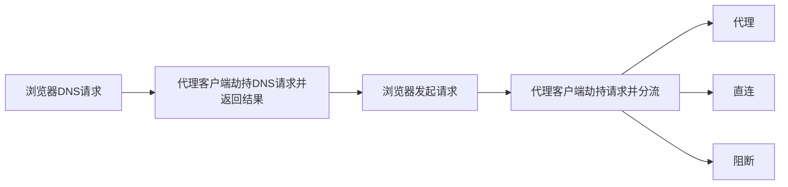
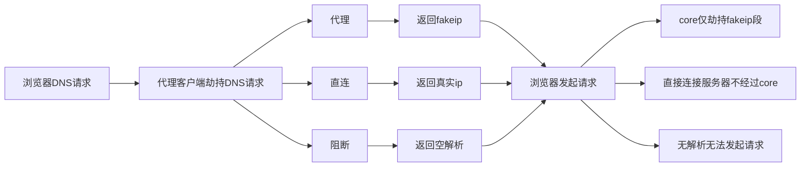

鉴于大部分人在透明代理中对 DNS 的行为一知半解，而 DNS 作为互联网连接的第一步，却被许多人一直忽视，令我感到十分不可思议。合理的 DNS 处理不仅能提高核心性能，防止代理 BT 流量，~~甚至能绕过 GFW 的封锁，实现 no-proxy 访问~~（本文并未涉及，敬请期待之后的文章）

# 讨论的范围
* 假设需要做 `proxy` `direct` `block` 三种类型的分流，且已有完善的 `geosite`
* 本文仅讨论`透明代理`下 `HTTP(S)` 访问的情况
* 假设读者具备`普通网络环境`下访问网站和`透明代理下发起 DNS 请求的时机`的知识

# 在发起连接之前
当你在浏览器输入一个域名时会发生什么？首先当然是 DNS 查询。其中浏览器会同时向系统配置的DNS服务器发起三条 DNS 请求：A 记录，AAAA 记录，和 HTTPS 记录
> 如果不了解 HTTPS 记录，可以参考 [这篇文章](https://taoshu.in/dns/dns-svcb-https.html)

总结一下，A/AAAA 记录获取域名的 ipv4 和 ipv6 地址，HTTPS 记录获取域名的 alpn 和 ECH 信息

# 传统透明代理的局限性
大部分人透明代理的网络拓扑可能类似这样：

注意到一些本无需经过 core 的流量进入了 core，增大了性能消耗
同时，劫持所有流量也会劫持到 BT 流量，以至于不得不采取其他方式规避
> 为什么不推荐代理 BT 流量可自行搜索

# 一点特殊的技巧
由于 HTTP(S) 访问之前基本都会发起 DNS 查询，因此使用 fakeip 不仅可以避免不必要的 DNS 查询，同时可避免 core 劫持额外的流量带来的性能消耗
如下图所示：

注意到在此种模式下，block流量直接在本机处理，direct 流量也直接经路由器（而不是 core）转发到外网，大大减少 core 的处理压力
同时，BT 流量因为既不会发起 DNS 请求，也不会出现在 fakeip 段内，自然也不会经过 core！

# 如何实践？
下面以 sing-box 为例，进行实操：

以下是 sing-box 配置示例
```json
{
    "dns": {
        "servers": [
            {
                "tag": "fakeip",
                "address": "fakeip"
            },
            {
                "tag": "ali-dns",
                "address": "223.5.5.5",
                "detour": "direct-out"
            },
            {
                "tag": "block-dns",
                "address": "rcode://success"
            }
        ],
        "rules": [
            {
                "outbound": "any",
                "server": "ali-dns"
            },
            {
                "geosite": "category-ads-all",
                "server": "block-dns"
            },
            {
                "geosite": "cn",
                "server": "ali-dns"
            },
            {
                "query_type": [
                    "A",
                    "AAAA"
                ],
                "server": "fakeip"
            }
        ],
        "final": "ali-dns",
        "reverse_mapping": true,
        "fakeip": {
            "enabled": true,
            "inet4_range": "198.18.0.0/16",
            "inet6_range": "fc00::/18"
        }
    },
    "route": {
        "rules": [
            {
                "protocol": "dns",
                "outbound": "dns-out"
            }
        ],
        "final": "proxy",
        "auto_detect_interface": true
    },
    "inbounds": [
        {
            "tag": "tun-in",
            "type": "tun",
            "interface_name": "sing-box",
            "inet4_address": "172.19.0.1/30",
            "inet6_address": "fdfe:dcba:9876::1/126",
            "mtu": 1420,
            "auto_route": true,
            "inet4_route_address": "198.18.0.0/16",
            "inet6_route_address": "fc00::/18",
            "stack": "mixed",
            "sniff": true
        },
        {
            "tag": "direct-in",
            "type": "direct",
            "listen": "::",
            "listen_port": 53,
            "sniff": true
        }
    ],
    "outbounds": [
        {
            "tag": "proxy",
            // 略
        },
        {
            "tag": "direct-out",
            "type": "direct"
        },
        {
            "tag": "dns-out",
            "type": "dns"
        }
    ]
}
```

以下是 iptables 示例
```bash
iptables -I FORWARD -i br-lan -o sing-box -j ACCEPT
ip6tables -I FORWARD -i br-lan -o sing-box -j ACCEPT
```

# 注意点
### 代理telegram
由于某些即时通讯工具（QQ、telegram）内置了 IP，不发起 DNS 查询，对于要代理 telegram 的情况，则将路由 IP 段改为：
```json
{
    "inet4_route_address": [
        "198.18.0.0/16",
        "91.105.192.0/23",
        "91.108.4.0/22",
        "91.108.8.0/21",
        "91.108.16.0/21",
        "91.108.56.0/22",
        "95.161.64.0/20",
        "149.154.160.0/20",
        "185.76.151.0/24"
    ],
    "inet6_route_address": [
        "fc00::/18",
        "2001:67c:4e8::/48",
        "2001:b28:f23c::/47",
        "2001:b28:f23f::/48",
        "2a0a:f280::/32"
    ]
}
```
### DNS 泄露
本配置实际存在 DNS 泄露问题，猜猜是哪个记录漏了？